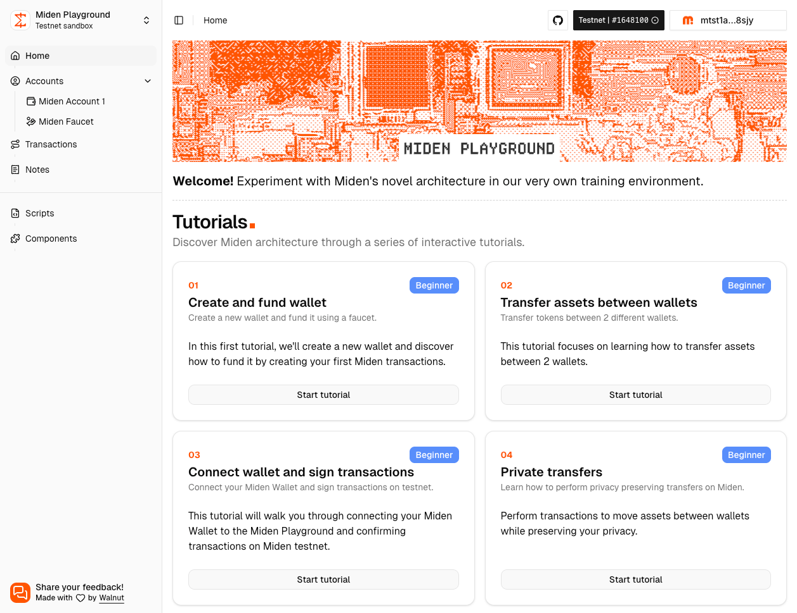

<p align="center">
  <h1 align="center">Miden Playground</h1>
</p>
<p align="center">
  <strong><i>Learn, Build and Deploy Miden smart contracts from a browser IDE.</i></strong>
  
</p>

This is the source code that runs the [Miden Playground](https://playground.miden.xyz) web application. Below you will find the docs on how to contribute to the project and get it up and running locally for further development.

Miden Playground is brought to you by [Walnut](https://www.walnut.dev).

## ⚙️ Installation

The app requires the following dependencies:

- [NodeJS](https://nodejs.org/) >= 22
- [pnpm](https://pnpm.io/fr/) >= 10

## 👩‍💻 Local Development

For contributing to the project, you can quickly get the application running by following these steps:

Clone this repository:

```sh
git clone https://github.com/walnuthq/miden-playground.git
```

Install dependencies:

```sh
pnpm install
```

Start up the app and see it running at http://localhost:3000

```sh
pnpm dev
```

### API configuration

Copy `.env.local.example` to `.env.local` and populate with your own values (PostgreSQL database URL, etc).

```sh
cp apps/api/.env.local.example apps/api/.env.local
```

Setup database:

```sh
pnpm --filter api db:push
```

Build Rust helpers:

```sh
pnpm --filter api build:rust
```

Install Miden Rust compiler using this guide: https://0xmiden.github.io/compiler/usage/cargo-miden.html

### Local node setup

When running the app locally, you can use the playground against a local node by selecting the "New Local sandbox" option, learn how to launch [miden-node](https://github.com/0xMiden/miden-node) following this guide: https://docs.miden.xyz/builder/develop/tutorials/miden_node_setup/

## 🚀 Deploying

Deployments are handled automatically by [Cloudflare](https://www.cloudflare.com/), as soon as your PR is merged to `main`.

## 🤗 Contributing

Miden Playground is built and maintained by a small team, so we would definitely love your help to fix bugs, add new features and improvements. Head on to the [issues tab](https://github.com/walnuthq/miden-playground/issues) to find a list of open contributions.

Before you submit a pull request, please make sure there isn't an existing [GitHub issue](https://github.com/walnuthq/miden-playground/issues). If there isn't, create one first to discuss the best way to approach it and also get some feedback from the team.

Once you are about to submit a pull request, prefix the name with either `chore:` (small improvements and regular maintenance), `fix:` (bugs and hot fixes), or `feat:` (new features) to help us quickly look up the type of the issue from the Git history.

### Coding conventions

The project is already pre-configured with [Eslint](.eslintrc.js), [TypeScript](tsconfig.json), and [Prettier](.prettierrc). Here are some useful commands you can run to ensure your changes follow the project's coding conventions:

Check for any linting issues and fix:

```sh
pnpm lint --fix
```

Check for any TypeScript issues:

```sh
pnpm check-types
```

## License

[MIT](LICENSE)
